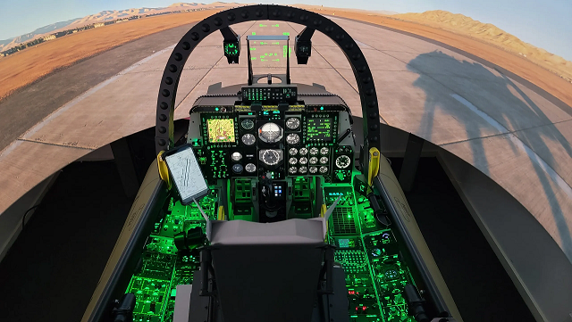
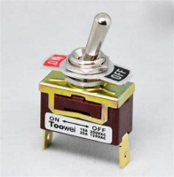
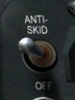
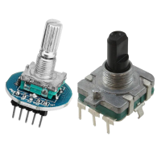
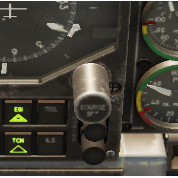
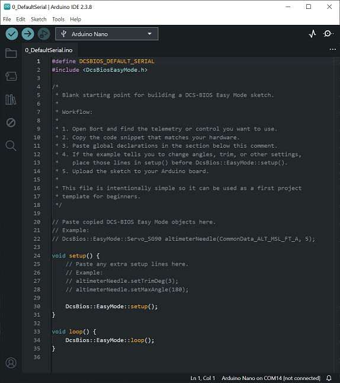
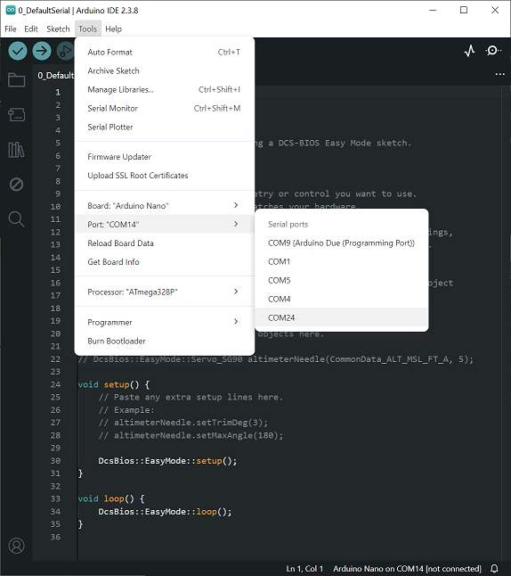
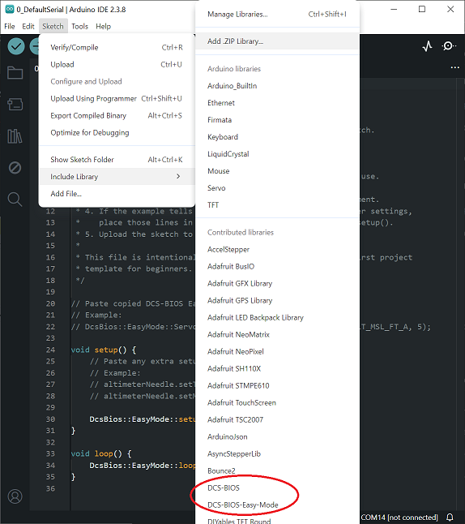

# DCS-BIOS Easy Mode Beginner Guide


## What's This Project All About?

This project is about the hobby of building Do-It-Yourself (DIY) aircraft flight simulator cockpits.
Instead of using only a mouse, keyboard, or game controller, many flight simulator hobbyists build physical cockpit controls so the simulator can be operated in a way that feels closer to the real aircraft. That can include things like switches, knobs, warning lights, gauge needles, radio panels, and complete instrument panels.

### Examples of "Sim-Pits"
Spitfire and other British "Warbirds" from WW1 and WWII are availble from the [AuthentiKit](https://authentikit.org/) project which makes available 3D printable controls that you can print on your own 3D printer and assemble with commonly available embedded electronics and other parts.

[](https://www.youtube.com/watch?v=ZDpGcKiBXVw)

Another example is from [YouTuber: The Warthog Project](https://www.youtube.com/@thewarthogproject) where he has created a complete A-10C cockpit using DCS-BIOS and other tools.


On his YouTube channel and [website "The Warthog Project - Building a Home Flight Simulator"](https://thewarthogproject.com/) he gives all the CAD assets and steps required to make your own A-10C cockpit controls and displays.

# The Flight Simulator
## DCS World - Digital Combat Simulator: World


In this guide, the simulator is [DCS World](https://www.digitalcombatsimulator.com/en/downloads/world/). 
The goal is to connect physical cockpit hardware to DCS so that:

- moving a real switch changes something in the simulator

 

- turning a real knob adjusts something in the simulator

 

- lights, gauges, and indicators in the simulator can be reproduced with real hardware on your desk or in a cockpit build

# ***INSERT SG90 and 28BY Steppers info and photos***

### This sits at the intersection of several hobbies:

- flight simulation
- DIY electronics
- Arduino and embedded programming
- scale cockpit building


This hobby can be entered into from very simple controls and expanded to a full cockpit with hundreds of elements including monitors. Enthusists aim to make physically accurate and functional reproductions of aircraft cockpits to use inside [flight simulator](https://en.wikipedia.org/wiki/Flight_simulator) environments, [DCS World](https://www.digitalcombatsimulator.com/en/downloads/world/) being the simulator in this guide.

Leveraging the embedded electronics hobby ecosystem, switches, knobs, LEDs, and other input devices can control the simulated cockpit inside the game.

Likewise, things that move in the simulator, like gauge needles, can be made into functional reproductions of the real aircraft instruments using commonly available and inexpensive RC servo motors and tiny stepper motors like the ones often used to move needles in automotive dashboards.

## The software pieces each do a different job:

- **DCS: World** (Digital Combat Simulator by Eagle Dynamics) is the flight simulator.
- **DCS-BIOS** ([DCS - Basic Input/Output System](https://en.wikipedia.org/wiki/BIOS)) is the bridge that exposes cockpit data and accepts cockpit commands.
- **DCS-BIOS Easy Mode** makes the Arduino code much simpler and easier to copy, paste, and understand.
- **Bort-EasyMode** is a Windows companion app and live reference tool that helps the hobbyist find the information needed to implement a particular simulated item, like a gauge (output) or switch (input), in an Arduino application ("sketch") that is built and uploaded to an Arduino development board.

DCS-BIOS and this user-friendly version, **DCS-BIOS Easy Mode**, fuse the flight simulation hobby with the DIY electronics and Arduino software hobby to help create a [simulation cockpit](https://en.wikipedia.org/wiki/Simulation_cockpit).

# Two words appear a lot in Arduino projects:

- **Arduino**: a small microcontroller board that can read switches, drive LEDs, and control small motors or servos.
- **Sketch**: the Arduino name for the program you write and upload to the board.

### The goal is simple:

1. Install the software you need.
2. Open a blank Arduino sketch.
3. Find the right code snippet in BORT (The DCS-BIOS Reference Tool).
4. Copy and paste it into the blank sketch.
5. Make only a few small changes for your own hardware.

### The examples in this guide are arranged as a learning path:

- Start with a very simple sketch.
- Move on to a one-way gauge.
- Then a centered-zero gauge.
- Then a more advanced derived gauge.
- And finally full aircraft panel examples.

If some of these words are new to you, that is normal. The point of this guide is to explain the workflow in the most accessible language possible.

This document is also intended to become a release handout later, so photo placeholders have been included where useful.

# What These Tools Do

Before starting, it helps to know what each tool is for.

## Arduino IDE (Integrated Development Environment)

This is the program used to open, edit, and upload Arduino "sketches" to your board.

"Sketches" are the programs written to run on the Arduino Embedded Electronics board.

Secretly, these "Sketches" are actually C++ (pronounced "see plus plus") programs with many Classes (programs inside programs) behind the scenes creating a "toolbox of tools" that you can use instead of having to develop youself. Everything from WiFi and Blutooth to controlling motors and displays. The Arduino ecosystem makes Embedded Electronics programming accessible to millions of users like yourself without the need to be a great C++ programmer. Better still, it has an open plugin "Library" where projects such as this one can be added to extend what Arduino is already capable of.



## DCS-BIOS Skunkworks

This is the part that reads information from DCS World and makes that information available to external hardware projects.
Before DCS-BIOS Skunkworks there was a DCS-BIOS. Skunkworks took over many years for reasons not relevant here. The important thing to note is that this project sits on top of the **Skunkworks** version, not the Original DCS-BIOS.


Examples:

- altitude
- heading
- bank angle
- switch positions
- warning lights

**DCS-BIOS Skunkwork Releases:** `https://github.com/DCS-Skunkworks/dcs-bios/releases`

# ***INSERT SCREEN GRABS OF INSTALLING DCS-BIOS FOR DCS AND FOR ARDUINO***

## DCS-BIOS Easy Mode

This project addresses a big problem with DCS-BIOS (Original and Skunkworks). They express the connections in terms of highly technical numbers instead of being in terms of what the physical control is doing. A Pitch Gauge for example, needs to be expressed in terms of how many degrees the needle needs to deflect up and down and that the zero position is in the middle. **DCS-BIOS Easy Mode** makes the setup parameters of these interfaces into the information that a real sim-pit builder thinks about.

**NOTE: This library sits on top of DCS-BIOS, it does not replace it.**

The DCS-BIOS Easy Mode library used in this guide comes from:

**DCS-BIOS Easy Mode Releases:** `https://github.com/wotupfoo/dcs-bios-arduino-easymode/releases`

Instead of thinking in low-level pulse widths or motor internals, the idea is to think in terms such as:

- minimum angle
- maximum angle
- trim
- clockwise or counter-clockwise
- zero at one end or zero in the middle

# ***INSERT SCREEN GRABS OF INSTALLING DCS-BIOS-EASY-MODE FOR ARDUINO***

## Bort-EasyMode

Bort-EasyMode is the Easy Mode version of Bort, the DCS-BIOS reference and code-snippet tool.

You use Bort-EasyMode to:

- Look up the telemetry name you want.
- See live values.
- Choose a code snippet for your hardware.
- Copy that snippet into Arduino IDE.

# ***INSERT SCREEN GRABS OF INSTALLING BORT-EASY-MODE***

## What You Need Installed

For your first DCS-BIOS Easy Mode project, install these five things in this order:

1. [DCS World](https://www.digitalcombatsimulator.com/en/downloads/world/)
2. [Arduino IDE](https://www.arduino.cc/en/software/)
3. [DCS-BIOS Skunkworks](https://github.com/DCS-Skunkworks/dcs-bios/releases)
4. [DCS-BIOS Easy Mode Arduino library](https://github.com/wotupfoo/dcs-bios-arduino-easymode/releases)
5. [Bort-EasyMode](https://github.com/wotupfoo/Bort-EasyMode/releases)

## Suggested Beginner Workflow

If you are new, follow this order:

1. Install DCS World.
2. Install DCS-BIOS from Skunkworks into Arduino IDE.
3. Install Arduino IDE.
4. Install DCS-BIOS Skunkworks so DCS can export telemetry.
5. Install DCS-BIOS Easy Mode into Arduino IDE.
6. Install Bort-EasyMode.
7. Open `0_DefaultSerial`.
8. Build and upload `0_DefaultSerial` once.
9. Open `1_Altimeter`.
10. Open `2_Pitch_EasyServo`.
11. Open `3_Rate_Of_Climb_from_Altitude`.
12. Open `4_Compass_Heading`.
13. Study `5_Spitfire_Blind_Panel`.
14. Study `6_Mosquito_Blind_Panel`.
15. Study `7_Mosquito_Fuel_Panel`.
16. Return to `0_DefaultSerial` for your own project.
17. Start DCS World and open Bort-EasyMode.
18. Copy the snippet you want from Bort-EasyMode.
19. Paste it into `0_DefaultSerial` and change only the first few things.
20. Build and upload your own sketch.

## Tip on what's what

For a beginner, the easiest mental model is:
- DCS World is the Digital Combat Simulator
- the DCS-BIOS plugin from Skunkworks for DCS World makes it possible to connect the simulation information with the real world.
- Ardiuno is a tool that can take software programs and put them on Arduino electronics boards
- one Ardiuno library (DCS-BIOS from Skunkworks) handles the communication from the board (typically over USB) to/from the DCS-BIOS plugin added to DCS World.
- one Ardiuno library (DCS-BIOS Easy Mode) sits in front of the DCS-BIOS software running on the Arduino board. It makes the Arduino environment more friendly and provides practical sim-pit examples. It also adds stepper motor support which DCS-BIOS from Skunkworks lacks.
- the Arduino electronics board. eg. Arduino Mega2560, Arduino Nano, Arduino UNO, Arduino Due, Arduino Bluepill, Arduino ESP32
- switches and knobs as well as moving items like Steppers and Servos built into mechanical components to emulate an aircraft cockpit control.

## Step 1: Install DCS World

Install DCS World the normal way for your computer:

[Download DCS World](https://www.digitalcombatsimulator.com/en/downloads/world/)

If DCS World is not installed yet, it is better to do that first so the rest of the toolchain has a real simulator to connect to later.

## **The DCS World downloaded content is HUGE.**
### **150 Gbytes to start with; another 30Gbytes or more per Map added.**
### **It takes a long time to download. So start it early.**

## Step 2: Install DCS-BIOS Skunkworks so DCS Can Export Telemetry

DCS-BIOS Skunkworks is what makes DCS telemetry available outside the simulator.

In simple terms:

- DCS World runs the aircraft.
- DCS-BIOS reads the aircraft data.
- Your Arduino sketch listens to that data.

The exact installer and screens may change over time, so if the current Skunkworks release looks a little different, that is normal.

Tip: this is where it's installed:
- `C:\[Username]\Saved Games\DCS\Scripts\export.lua`
- `C:\[Username]\Saved Games\DCS\Scripts\DCS-BIOS\`

- DCS-BIOS is installed into your `Saved Games` area.
- DCS is allowed to export data.
- Live telemetry is available while DCS is running.

Photo placeholder:

- Add screenshot of the DCS-BIOS folder in Saved Games.

## Step 3: Install Arduino IDE

Install Arduino IDE the normal way for your computer:

[Download Arduino IDE](https://www.arduino.cc/en/software/)

When it opens for the first time:

1. Connect your Arduino by USB.
2. Choose your board from the `Tools` menu.
3. Choose the correct COM port from the `Tools` menu.



If upload fails later, the most common cause is the wrong board or wrong COM port being selected.

## Step 4: Install DCS-BIOS From Skunkworks Into Arduino IDE

You need two parts from this download.
- The DCS-BIOS part that is installed the DCS World Save Game directory.
Get the ZIP file from the [DCS-BIOS Skunkworks releases](https://github.com/DCS-Skunkworks/dcs-bios/releases).

- The Arduino DCS-BIOS Library available inside Arduino IDE. This is installed from a downloaded ZIP file.
The Arduino library ZIP file is inside the DCS-BIOS plugin ZIP (above).

Installing the **DCS-BIOS** Arduino library:
1. Open Arduino IDE.
2. Choose `Sketch > Include Library > Add .ZIP Library...`.
3. Add the DCS-BIOS Arduino library ZIP.

## Step 5: Install DCS-BIOS Easy Mode Into Arduino IDE

You also need the DCS-BIOS Easy Mode Arduino library available inside Arduino IDE.

Get the ZIP file from the [DCS-BIOS Easy Mode releases](https://github.com/wotupfoo/dcs-bios-arduino-easymode/releases).

Installing the **DCS-BIOS Easy Mode** Arduino library:
1. Open Arduino IDE.
2. Choose `Sketch > Include Library > Add .ZIP Library...`.
3. Add the DCS-BIOS Easy-Mode Arduino library ZIP.

After installation, Arduino IDE should be able to open the example sketches from the `File > Examples` menu.



## Step 6: Install Bort-EasyMode

Install the DCS-BIOS Easy Mode version of Bort from [Bort-EasyMode releases](https://github.com/wotupfoo/Bort-EasyMode/releases).

Then run Bort-EasyMode.

When Bort-EasyMode first opens, it may need to be pointed at the DCS-BIOS folder that holds all the information about each of the aircraft.
If you see a blank application after **waiting up to 30 seconds for it to load** you may need to tell Bort where your aircraft information is.

Tip: this is typically: `C:\[Username]\Saved Games\DCS\Scripts\DCS-BIOS\doc\json`

1. Open the `Menu`.
2. Choose `Select dcs-bios location`.
3. Point it to the DCS-BIOS JSON folder.

Bort-EasyMode is mainly used as a lookup and copy-paste tool. Think of it as the parts catalog and code generator for the project.

Photo placeholder:

- Add screenshot of Bort-EasyMode showing a selected telemetry item and its code snippets.

## Step 7: Open 0_DefaultSerial

The numbered journey starts with a blank starting sketch for beginners:

`examples/0_DefaultSerial/0_DefaultSerial.ino`

This is the recommended first file to open when building from a Bort-EasyMode snippet.

It already contains:

- the required `#define DCSBIOS_DEFAULT_SERIAL`
- the correct Easy Mode include
- `DcsBios::setup();`
- `DcsBios::loop();`
- comments showing where copied lines should be pasted

If you are unsure where copied code belongs, start with this file.

## Step 8: Build And Upload 0_DefaultSerial Once

Before changing anything, build and upload `0_DefaultSerial` one time.

This proves that:

- Arduino IDE is working.
- The correct board is selected.
- The correct COM port is selected.
- The Easy Mode library is installed correctly.

It is better to find simple setup problems here than later in a more complicated sketch.

From this point on, the steps in this guide stay simple on purpose. There is a lot more detail in the comments inside each example sketch. Read the comments in the example to better understand what it is doing and why it is built that way.

## Step 9: Open 1_Altimeter

Open `1_Altimeter` and look at the simplest complete gauge example in the journey.

This is where the user first sees a working Easy Mode output object in a very small sketch.

## Step 10: Open 2_Pitch_EasyServo

Open `2_Pitch_EasyServo` next.

This introduces a centered-zero gauge using a common beginner servo.

## Step 11: Open 3_Rate_Of_Climb_from_Altitude_EasyServo

Open `3_Rate_Of_Climb_from_Altitude_EasyServo` next.

This shows a more advanced idea: creating a useful gauge value from other telemetry when a direct output is missing.

## Step 12: Open 4_Compass_Heading

Open `4_Compass_Heading` next.

This introduces a wrap-around gauge, which behaves differently from the previous sweep-style examples.

## Step 13: Study 5_Spitfire_Blind_Panel

Study `5_Spitfire_Blind_Panel` as the first full panel example.

This shows how several instruments can live together in one sketch.

## Step 14: Study 6_Mosquito_Blind_Panel

Study `6_Mosquito_Blind_Panel` next.

This is another full panel example that reinforces the same patterns in a different aircraft.

## Step 15: Study 7_Mosquito_Fuel_Panel

Study `7_Mosquito_Fuel_Panel` next.

This shows how maintained switches and input synchronization fit into the same Easy Mode journey.

## Step 16: Return To 0_DefaultSerial For Your Own Project

After you understand the numbered examples, come back to `0_DefaultSerial`.

That is the recommended file to start from when making your own instrument or control from a Bort-EasyMode snippet.

## Step 17: Start DCS World And Open Bort-EasyMode

Start DCS World and load into a flight where the instrument you want can be seen working.

Then open Bort-EasyMode.

Bort-EasyMode is a Windows companion app and live reference tool. It helps you find the telemetry or control name you need, and it shows copy-paste code snippets for common Arduino hardware.

In Bort-EasyMode, `CommonData` means shared, non-aircraft-specific telemetry sources. These are values that are useful across many aircraft, such as altitude, latitude, longitude, and other general flight data.

There are also many aircraft-specific telemetry sources. These only work for one aircraft.

It is very important to choose the exact aircraft you own and are going to fly in DCS World, or the telemetry will not work. For example, the free `TF-51` that comes with the game looks very similar to the purchased `P-51D`, but it is not the same aircraft as far as DCS-BIOS is concerned. `P-51D` telemetry will not work in the `TF-51`.

Also note that the free aircraft do not have aircraft-specific telemetry. Only purchased aircraft have aircraft-specific telemetry, so for free aircraft you will usually need to use `CommonData`.

Then use Bort-EasyMode like this:

1. Choose the exact aircraft you are flying, or choose `CommonData`.
2. Search for the gauge or control.
3. Look at the code snippets shown for that output.

Choose the snippet that matches your hardware.

Examples:

- SG90 servo: choose the `DcsBios::EasyMode::Servo_SG90` snippet.
- Generic servo: choose the `DcsBios::EasyMode::Servo` snippet.
- Generic stepper: choose a generic stepper snippet.
- 28BYJ-48 stepper: choose a `28BYJ48` snippet.

## Step 18: Copy The Snippet From Bort-EasyMode

This is the easiest beginner method.

From Bort-EasyMode, copy the hardware snippet you want.

Examples:

- `DcsBios::EasyMode::Servo_SG90 ...`
- `DcsBios::EasyMode::Stepper ...`
- `DcsBios::EasyMode::Stepper_28BYJ48 ...`

## Step 19: Paste It Into 0_DefaultSerial And Change Only The First Few Things

Paste the main object line near the top of the blank sketch, above `setup()`.

If the example also tells you to add extra tuning lines such as:

- `setMaxAngle(...)`
- `setMinAngle(...)`
- `setTrimDeg(...)`
- `setModulusEnabled(...)`

put those lines inside `setup()`, before `DcsBios::setup();`

A beginner will usually only need to change:

- telemetry source name
- Arduino pin numbers
- zero detection pin
- whether zero is at the start or in the middle
- maximum angle
- minimum angle
- trim

## Step 20: Build And Upload Your Own Sketch

The simplest copy-paste pattern is:

1. Paste the Bort snippet above `setup()`.
2. Paste any extra adjustment lines into `setup()`.
3. Build and upload.

Example:

```cpp
#define DCSBIOS_DEFAULT_SERIAL
#include "DcsBiosEasyMode.h"

DcsBios::EasyMode::Servo_SG90 altimeterNeedle(
    CommonData_ALT_MSL_FT_A,
    5
);

void setup() {
    altimeterNeedle.setTrimDeg(3);
    DcsBios::setup();
}

void loop() {
    DcsBios::loop();
}
```

That is the basic pattern for most Easy Mode builds.
## What Each Example Is For

The example sketches in this library are not just random demos. Each one is meant to answer a common beginner question.

### 0_DefaultSerial

File:
`examples/0_DefaultSerial/0_DefaultSerial.ino`

What it is:

- A clean starting sketch for copy-paste use.
- The best first file for someone using Bort.

Use it when:

- You want to start from a blank project.
- You want to paste one Bort snippet into a known-good template.

Things the user will usually change:

- pasted object lines
- pasted setup lines

Photo placeholder:

- Add screenshot of the blank example open in Arduino IDE.

### 1_Altimeter

File:
`examples/1_Altimeter/1_Altimeter.ino`

What it is:

- A bounded generic stepper example.
- A good model for gauges that need more travel than a servo can provide.

Use it when:

- You have a generic 4-wire stepper
- The gauge starts at one end of the scale and moves upward from there

Usually changed by the user:

- motor pins
- zero detection pin
- whether zero is at the start or in the middle
- maximum angle

Important idea:

- The hardware connection is in the object line.
- The real instrument travel is adjusted later with `setMaxAngle()`.

Photo placeholder:

- Add photo of a generic stepper and driver board connected to an altimeter dial.

### 2_Pitch_EasyServo

File:
`examples/2_Pitch_EasyServo/2_Pitch_EasyServo.ino`

What it is:

- A centered-zero SG90 servo example using pitch.
- A good first example for signals that move up and down around a center mark.

Use it when:

- The instrument zero is in the middle
- The signal can go both negative and positive from the center

Usually changed by the user:

- servo pin
- instrument sweep angles
- direction

Important idea:

- The final `true` value tells the library that the signal zero is in the middle of the range.

Photo placeholder:

- Add photo of a nose-up nose-down pitch gauge with a center mark.

### 3_Rate_Of_Climb_from_Altitude_EasyServo

File:
`examples/3_Rate_Of_Climb_from_Altitude_EasyServo/3_Rate_Of_Climb_from_Altitude_EasyServo.ino`

What it is:

- An advanced SG90 servo example that creates rate of climb from altitude changes.
- A natural next step after `2_Pitch_EasyServo`.

Use it when:

- Your aircraft does not expose a direct VVI / variometer output
- You still want to drive a rate-of-climb gauge

Usually changed by the user:

- servo pin
- the update interval
- the assumed climb/descent range
- instrument sweep angles

Important idea:

- This example uses `CommonData_ALT_MSL_FT` and calculates feet per minute in the sketch.

Photo placeholder:

- Add photo of a derived rate-of-climb gauge driven from altitude metadata.

### 4_Compass_Heading

File:
`examples/4_Compass_Heading/4_Compass_Heading.ino`

What it is:

- A continuous generic stepper example.
- A good starting point for repeating 360 degree instruments.

Use it when:

- The instrument goes around and around
- 360 degrees should behave the same as 0 degrees

Usually changed by the user:

- motor pins
- zero detection pin
- whether zero is at the start or in the middle
- whether modulus wrapping stays on

Important idea:

- This example is for repeating motion, not a fixed end-stop sweep.

Photo placeholder:

- Add photo of a compass or heading repeater driven by a generic stepper.

## Advanced Examples
The following examples expand on the lessons learned in examples 0 through 7.
Unlike the starting examples that use commonly available Steppers (Tiny 28BYJ-48 + ULN2003 Driver chip) and RC Servo Motor SG90/MG90 that have all of it's properties captured in the driver so that you, the user, doesn't have to provide the information.
In contrast, these examples use the Generic version of EasyStepper and EasyServo where all the physical properties of the Stepper or Servo have to be defined.

### 91_Altimeter_EasyStepper

File:
`examples/91_Altimeter_EasyStepper/91_Altimeter_EasyStepper.ino`

What it is:

- The same altimeter idea as above, but for the common 28BYJ-48 and ULN2003 board.

Use it when:

- You have a 28BYJ-48 stepper
- You want a beginner-friendly stepper example with fewer setup details

Usually changed by the user:

- motor pins
- zero detection pin
- whether zero is at the start or in the middle
- maximum angle

Photo placeholder:

- Add photo of a 28BYJ-48 and ULN2003 board driving an altimeter dial.

### 92_Compass_Heading

File:
`examples/92_Compass_Heading/92_Compass_Heading.ino`

What it is:

- The same heading idea as the generic compass example, but with a 28BYJ-48.

Use it when:

- You have a 28BYJ-48 stepper
- You want a 360 degree repeating instrument

Usually changed by the user:

- motor pins
- zero detection pin
- whether zero is at the start or in the middle
- whether modulus wrapping stays on

Photo placeholder:

- Add photo of a 28BYJ-48 turning a compass card or heading pointer.


## Suggested Learning Path

For a natural progression through the examples:

- Start with `1_Altimeter` to learn a simple one-way gauge.
- Move to `2_Pitch_EasyServo` to learn centered-zero gauges.
- Then try `3_Rate_Of_Climb_from_Altitude` to learn how to derive a gauge value from other telemetry.
- Continue with `4_Compass_Heading`, then the full blind-panel examples.

## Which Example Should I Start With?

If you have:

- no idea where to start and you just want to paste from Bort: start with `0_DefaultSerial`
- a 28BYJ-48 stepper and a one-way gauge: start with `1_Altimeter`
- an SG90 or MG90 servo and a centered-zero gauge: start with `2_Pitch`

- a generic 4-wire stepper and a one-way gauge: start with `91_Altimeter_Advanced`
- a generic servo and a one-way gauge: start with `92_Pitch_Advanced`
- a generic 4-wire stepper and a wrapping gauge: start with `94_Compass_Heading_Advanced`


## Common Beginner Mistakes

These are the most common first-time problems:

### The sketch uploads, but the gauge does not move

Check:

- DCS is running
- DCS-BIOS is installed and exporting data
- the correct telemetry item was chosen in Bort
- the board and COM port are correct in Arduino IDE
- wiring is correct

### The gauge moves the wrong way

Check:

- reverse the direction setting to accomodate your gear train being backwards
- motor wire order (Steppers)

### The gauge moves, but the sweep is too small or too large

Check:

- `setMinAngle(...)`
- `setMaxAngle(...)`
- gearing between the motor and the needle

### The zero point is wrong

Check:

- trim
- zero detection sensor position
- whether zero should be at the low end or in the middle

## Notes For Later PDF Release

Before turning this into a PDF for release, it would be useful to add:

- a screenshot of Arduino IDE with the blank sketch open
- a screenshot of Bort with a snippet selected
- one hardware photo for each example
- a simple servo wiring diagram
- a simple generic stepper wiring diagram
- a simple 28BYJ-48 plus ULN2003 wiring diagram
- a one-page troubleshooting appendix

## Drafting Note

This work was created as a guided collaboration between a human project lead and an AI acting as a virtual software engineer. The human role was not mainly to sit and type code line by line. Instead, the human role was closer to that of a team manager: setting the direction, explaining the goals in plain English, deciding what problems mattered most, reviewing the results, and steering the project toward something genuinely useful for cockpit builders. In practical terms, the human side managed the product vision while the AI handled much of the day-to-day software implementation. From the first discussion to the completed code changes, examples, Bort updates, and documentation draft, the work took less than a day.

The AI contribution went beyond simple code generation. It was used as a working software engineer that could take an English discussion, understand the intended outcome, and then turn that into real library changes, updated examples, improvements to Bort, and supporting documentation. That made it possible for the project to move from idea to implementation quickly, even though the human side did not generally write most of the code directly.

An important part of that work was research. The AI was able to study the surrounding context of DCS World, flight simulators, virtual cockpit building, instrument behavior, and the kinds of telemetry and hardware combinations that hobby builders actually use. That research helped the project avoid becoming a purely software-focused exercise. Instead, it supported decisions that made sense for real gauges, real panels, and real users trying to copy, paste, wire, and test their own cockpit parts.

That same collaboration also helped identify a broader design problem: DCS-BIOS and Bort were powerful tools, but they often assumed more software knowledge than many builders have or want to have. Many users are strong in aircraft systems, electronics, and physical fabrication, but may not be comfortable with programming language, software abstractions, or reading raw code. A major goal of this project was therefore to reduce that barrier and reshape the experience so it felt more welcoming to non-programmers.

With that goal in mind, the AI helped reshape both the code and the user experience. It contributed to the design and implementation of DCS-BIOS Easy Mode, created example sketches based on real DCS World telemetry, modified Bort so its generated snippets were easier to understand and copy into Arduino IDE, and helped produce beginner-friendly instructions for installing and using the whole toolchain. The result is not only a set of software changes, but also a more accessible workflow for people who want to build virtual cockpit hardware without needing to think like professional software developers.

